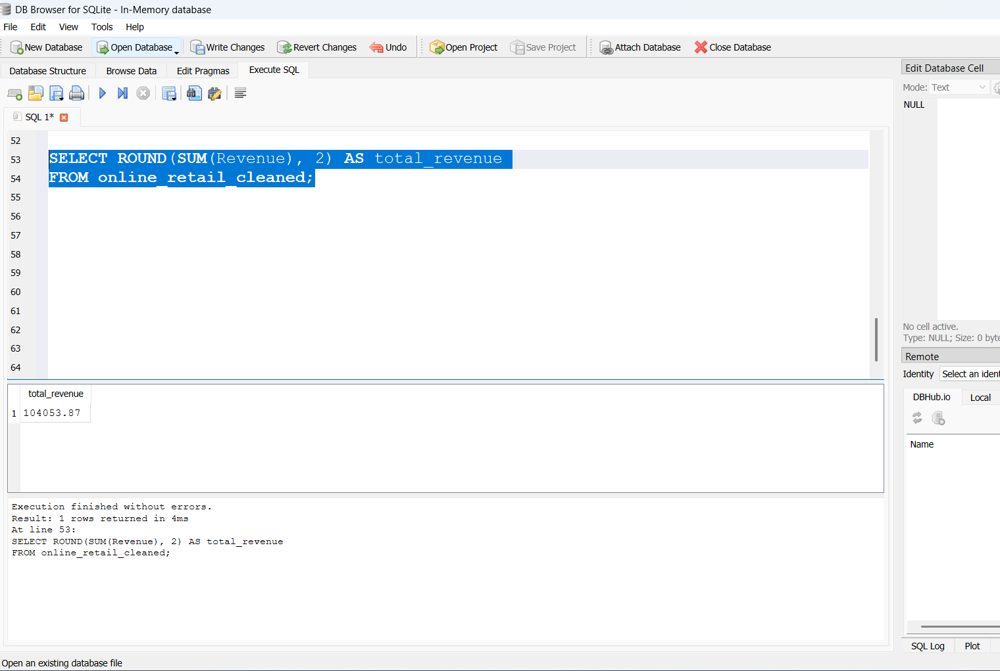
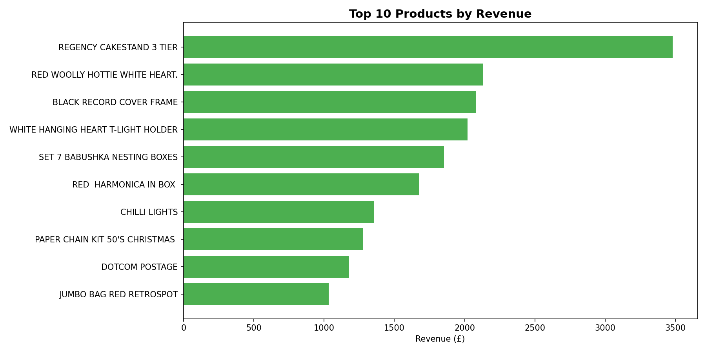
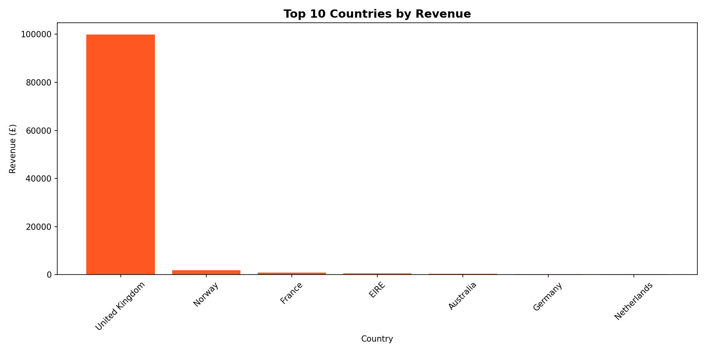
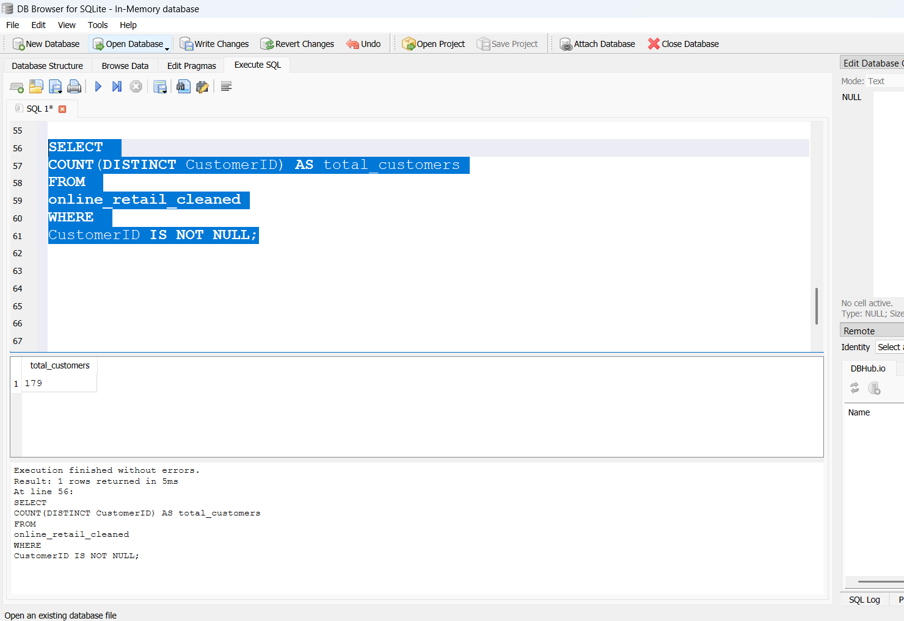
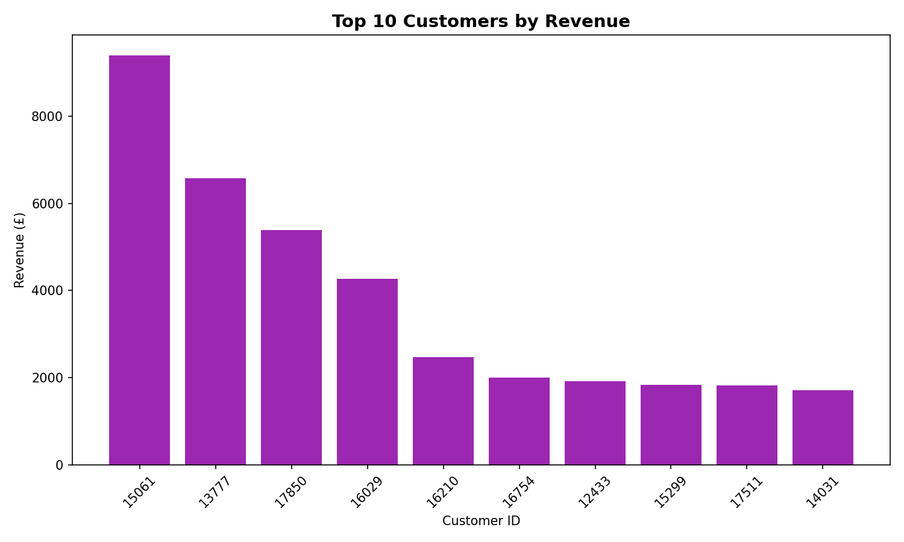
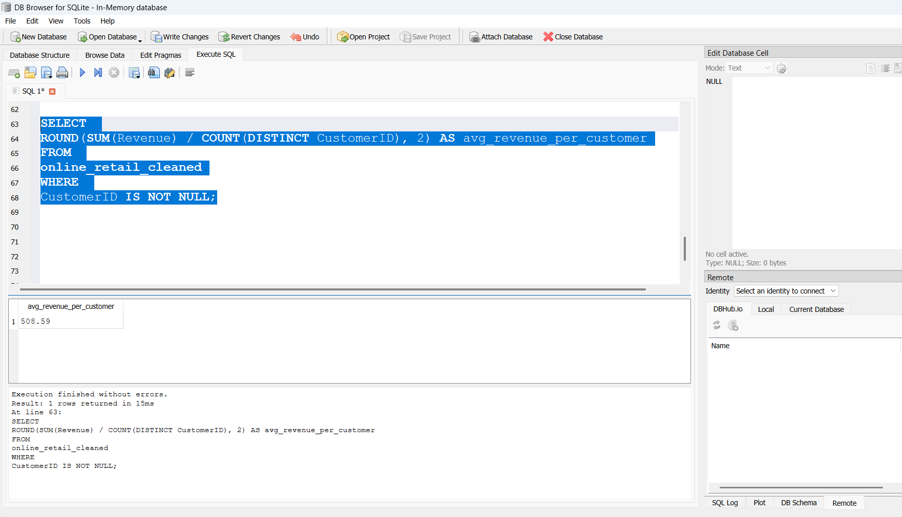

# E-Commerce Business Intelligence Analytics (SQL + Python + Power BI)

## Project Overview

This project presents an end-to-end Business Intelligence case study using an online retail transactions dataset.

The objective was to:
- Clean transactional sales data
- Analyze revenue performance
- Identify high-value products and customers
- Extract actionable business insights

The analysis was performed using:
- **SQLite (SQL queries)**
- **Python (Exploratory Data Analysis)**
- **Power BI (Dashboard design)**

The analytical approach and insights are applicable to global e-commerce businesses across different markets.

---

## Problem Statement

E-commerce businesses generate large volumes of transactional data.  
However, without structured analysis, it becomes difficult to clearly understand revenue drivers, customer purchasing behavior, and retention patterns.

This project simulates a real-world Business Intelligence workflow by transforming raw transactional data into structured, actionable business insights.

## Scope & Limitations
This project focuses on descriptive and diagnostic analytics using SQL (SQLite) and exploratory analysis.

No predictive modeling or advanced machine learning techniques were applied.  
The objective was to strengthen core Business Intelligence foundations such as data cleaning, KPI aggregation, trend analysis, and business insight generation.

## Business Questions
- What is total revenue, total orders, total customers, and average order value (AOV)?
- Which products and customers contribute the most to revenue?
- How does revenue trend over time (monthly/seasonal pattern)?
- What is the repeat purchase rate, and what does it imply about retention?
- Which countries/markets drive the highest revenue?

## Dataset
Transactional dataset containing invoice-level purchases (InvoiceNo, StockCode, Description, Quantity, InvoiceDate, UnitPrice, CustomerID, Country).

> Note: Dataset used for learning and portfolio demonstration. No personal or confidential business data is included.

## Skills Demonstrated

- SQL (SQLite) – Data cleaning, filtering, aggregation
- Revenue & KPI analysis
- Customer revenue concentration analysis
- Date transformation & grouping
- Business insight generation
- Analytical storytelling
- Dashboard-ready data preparation
- Business interpretation of data

## Workflow (Real-world Style)
1. **Data Cleaning**
   - Remove cancellations (InvoiceNo starting with "C")
   - Remove invalid Quantity/UnitPrice (≤ 0)
   - Handle missing CustomerID for customer-level analysis
   - Create Revenue = Quantity × UnitPrice
   - Extract Month from InvoiceDate

2. **SQL Analysis**
   - KPI extraction (Revenue, Orders, Customers, AOV)
   - Repeat customer analysis + repeat revenue contribution
   - Top customers/products + country performance

3. **Python EDA**
   - Data quality checks + distributions
   - Time trend exploration
   - Revenue concentration (top products/customers)
   - Optional: basic RFM segmentation (non-ML)

4. **Power BI Dashboard**
   - Executive Overview page (KPIs + trends)
   - Customer & Product Insights page
   - Retention/Funnel page

## Deliverables

- SQL scripts → `/sql`
- Python notebooks → `/python`
- Power BI dashboard → `/powerbi`
- Dashboard screenshots → `/images`
- Executive summary → `/reports`
  

## Revenue Analysis (SQLite)

### Total Revenue
Total revenue was calculated using:
SUM(Quantity * UnitPrice)

This shows the overall sales after cleaning invalid records.

---

### Monthly Revenue
Monthly revenue was calculated using SQLite date functions to group sales by month.

This helps identify sales trends over time.

---

### Top 10 Products by revenue
This identifies the highest revenue generating products.

---

### Revenue by Country
This shows which countries generate the most revenue.

---

## Customer Analysis

### Total Unique Customers
This calculates the total number of distinct customers after cleaning the dataset.

---

### Top 10 Customers by Revenue
This identifies the highest revenue-generating customers.

---

### Average Revenue Per Customer
This measures customer value by dividing total revenue by total customers.

## Key Insights 

- Revenue varies by month, indicating strong seasonality patterns.
- A small percentage of products and customers generate a large share of total revenue (revenue concentration effect).
- The United Kingdom dominates total revenue, confirming it as the core market.
- Revenue is concentrated among high-value customers, highlighting the importance of customer retention strategies.
- Average revenue per customer provides a benchmark for estimating customer lifetime value.

## Business Impact Interpretation

If implemented in a real e-commerce business, these findings could support:

- Seasonal demand forecasting
- Inventory optimization
- High-value customer retention strategies
- Geographic market prioritization
- Revenue growth planning

## Next Improvements
- Add cohort retention view by month
- Enhance dashboard design using a consistent theme and layout
- Add basic RFM segmentation summary to support targeted retention strategies

## Professional Relevance

This project reflects practical Business Intelligence and Data Analytics capabilities applicable across:

- E-commerce
- Retail analytics
- Customer performance analysis
- Revenue and KPI reporting environments

The workflow demonstrates readiness for analytical roles requiring structured SQL querying, performance reporting, and business-focused data interpretation.

---

## Continuous Learning

This project is part of my transition into Data Analytics and Business Intelligence.

It reflects hands-on development of:
- SQL query writing
- Data transformation
- Revenue performance analysis
- Customer segmentation thinking
- BI dashboard preparation

The goal is to strengthen technical and analytical skills while building a globally relevant BI portfolio.
